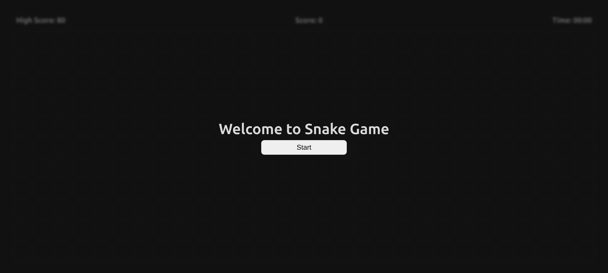
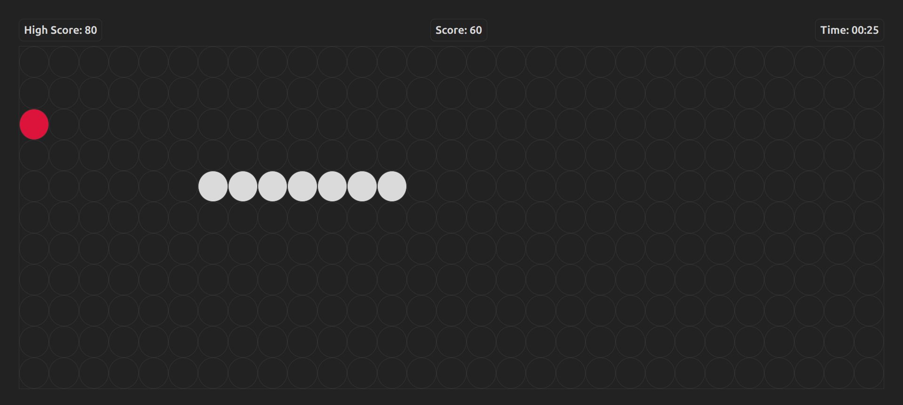
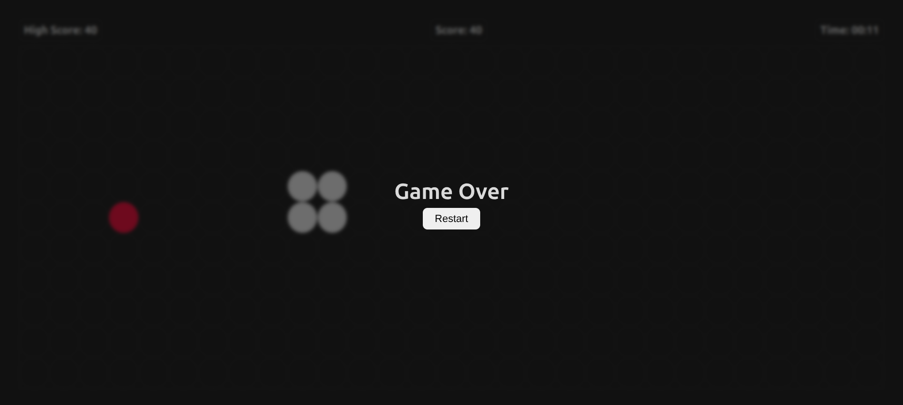

# 🐍 Simple JS Snake Game

A simple browser-based Snake game built using HTML, CSS, and Vanilla JavaScript.

## 📸 Screenshots

### Start Screen

### Gameplay

### Game Over

## 🎮 Features

- Arrow key controls
- Wall collision detection
- Self collision detection
- Score tracking
- High score saved using localStorage
- Game timer
- Restart option

## 🛠 Tech Stack

- HTML
- CSS
- JavaScript (Vanilla JS)

## ▶️ How to Run

1. Clone the repository
2. Open `index.html` in your browser
3. Click **Start** and play

## 🎯 Controls

- Arrow Up → Move Up  
- Arrow Down → Move Down  
- Arrow Left → Move Left  
- Arrow Right → Move Right  

---

Made for learning and practice.